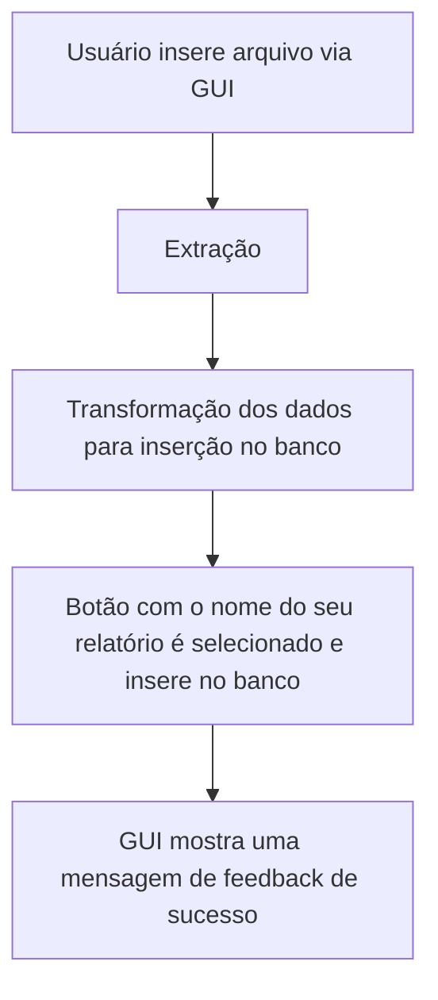

# 🗁 Extrator Excel ETL
Repositório com infraestrutura de código no design pattern formato ETL para extração de dados em excel e inserção em um banco de dados pré-pronto.

### ⬇ Estrutura
- **Extraction**: Extração dos dados em excel. onde acontece a extração dos seus dados que estão na planilha. 
- **Transform**: Onde seus dados são transformados e ficam prontos pra inserção no seu banco.
- **Load**: É a parte onde seus dados são inseridos no banco.

Aqui está uma representação gráfica simples do funcionamento do projeto:



Caso ocorra um erro na inserção, a seguinte lógica ocorre:


### ⏣ Instalação

Antes de prosseguir com a instalação, lembre-se de mudar o nome do arquivo ```db_config.example.json``` para somente ```db_config.json``` ou configurar seu ```.env```. 

Se for prosseguir com o arquivo json, aqui esta uma estrutura simples para conexão. 

```json
{
  "host": "localhost",
  "port": 5432,
  "database": "seu_banco",
  "user": "postgres",
  "password": "sua_senha"
}
```

1. **Clone o repositório em uma pasta de sua escolha**

```bash 
git clone https://github.com/ranielcaria/data-etl-extractions
cd data-etl-extractions
```

2. **Instale as dependências**

Utilize o terminal (Pode ser o da sua IDE) e entre na raiz do projeto. Depois, utilize este comando:

```bash 
python -m pip install . 
``` 

> Nota: Se você pretende utilizar o conteúdo deste repositório para desenvolvimento, você deve utilizar: 
```bash
pip install -e . 
```

Após, você está pronto para começar a utilizar! só execute o arquivo `` main.py `` e comece!

Se tudo foi feito corretamente, este menu deve aparecer ao executar o arquivo ```main.example.py```:

<p align="center">
  <br>
  <em>Interface principal do Menu</em>
</p>

> Atenção! Lembre-se de ter um banco de dados pré-configurado antes de testar a funcionalidade dos botões.

Configure uma tabela no seu banco de dados com o nome 'example' e com uma única coluna com o nome também de 'example'. Ou utilize este código sql:

```sql
CREATE SCHEMA IF NOT EXISTS "pms";

CREATE TABLE IF NOT EXISTS "pms"."example" (
	example TEXT
);
```

Após a criação da tabela de exemplo, execute o arquivo ```main.example.py``` e pressione o botão escrito 'Exemplo'. Se um pop-up com rótulo de 'Sucesso' e com a mensagem 'ETL Concluído para example-extractor' aparecer, está tudo funcionando e você está pronto para começar a escrever seus próprios extratores de dados excel!  