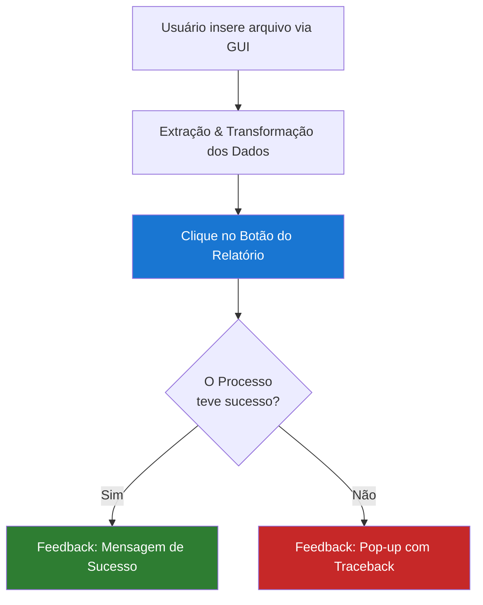
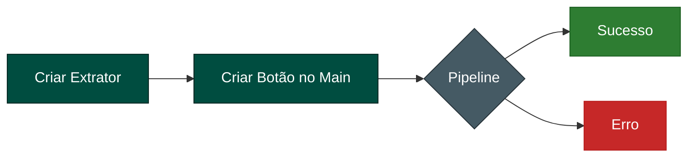

# 🗁 Extrator Excel ETL
Repositório com infraestrutura de código no design pattern formato ETL para extração de dados em excel e inserção em um banco de dados pré-pronto.

### ⬇ Estrutura
- **Extraction**: Extração dos dados em excel. onde acontece a extração dos seus dados que estão na planilha. 
- **Transform**: Onde seus dados são transformados e ficam prontos pra inserção no seu banco.
- **Load**: É a parte onde seus dados são inseridos no banco.

Aqui está uma representação gráfica simples da lógica do projeto:



Workflow do repositório para desenvolvimento se segue:



Todo o trabalho pesado de workflow de código é feito pelo pipeline. Assim, a lógica de adição de novos extratores e botões é tudo o que é necessário para aumentar o menu. Um ponto importante para se ressaltar é a distribuição dos botões que é feita em colunas e linhas utlizando um sistema de coordenadas,por isso, tome cuidado para não ter 'botões encima de botões' e acrescente a posição do botão sempre que adicionar um novo, para evitar o problema.

### ⏣ Instalação

Antes de prosseguir com a instalação, lembre-se de mudar o nome do arquivo ```db_config.example.json``` para somente ```db_config.json``` ou configurar seu ```.env```. Também renomeie o arquivo ```main.example.py``` para somente ```main.py``` assim que seu projeto estiver pronto. É recomendado uma interface gráfica de gerenciamento de banco de dados. Como o projeto foi feito utilizando ```psycopg2```, utilizaremos o pgAdmin como referência. Caso tenha outra preferência, faça passos equivalentes na sua GUI ou CLI de escolha.

Se for prosseguir com o arquivo json, aqui esta uma estrutura simples para conexão. 

```json
{
  "host": "localhost",
  "port": 5432,
  "database": "seu_banco",
  "user": "postgres",
  "password": "sua_senha"
}
```

1. **Clone o repositório em uma pasta de sua escolha**

```bash 
git clone https://github.com/ranielcaria/data-etl-extractions
cd data-etl-extractions
```

2. **Instale as dependências**

Utilize o terminal (Pode ser o da sua IDE) e entre na raiz do projeto. Depois, utilize este comando:

```bash 
python -m pip install . 
``` 

> Nota: Se você pretende utilizar o conteúdo deste repositório para desenvolvimento, você deve utilizar: 
```bash
pip install -e . 
```

Se tudo foi feito corretamente, este menu deve aparecer ao executar o arquivo ```main.example.py``` (ou ```main.py``` se já o tiver renomeado):

<p align="center">
  <br>
  <em>Interface principal do Menu</em>
</p>

**Atenção ⚠**

Até aqui, foi passada a configuração inicial para que você começasse a desenvolver sua própria extração de dados de relatórios excel utilizando este repositório. Para que você possa utilizar seus relatórios pessoais, você _**precisará**_ criar arquivos de extração de dados que atendam ao seu relatório. Cada relatório é único e montado de uma forma diferente. Por isso, não é possível fazer um que seja universal, a menos que haja um padrão claro sendo seguido. Após este esclarecimento, seguimos.

> Nota: Caso for desenvolver utilizando este projeto, não se esqueça de criar seus extratores dentro da pasta 'extractors' dentro de api/extractors.

> Atenção! Lembre-se de ter um banco de dados pré-configurado antes de testar a funcionalidade dos botões. Caso não tenha, siga os passos a seguir para instalar o Docker em sua máquina. 

**RPM Based Distro**:
```bash
sudo dnf install docker
sudo dnf install -y docker compose
```

**Debian Based Distro**:
```bash
sudo apt install docker
sudo apt install docker-compose
```

**OPENSuse**:
```bash
sudo zypper install docker
sudo zypper install docker-compose
```

Agora certifique-se de que o serviço do docker esta rodando no fundo e que seu usuário tem permissão para executá-lo com o comando abaixo:

> Nota: Este passo pode exigir logout/login

```bash
sudo systemctl enable --now docker
sudo usermod -aG docker $USER
```

Após instalar o docker, clique no botão de switch no menu e você está com seu banco de dados para teste pronto!